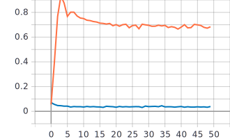
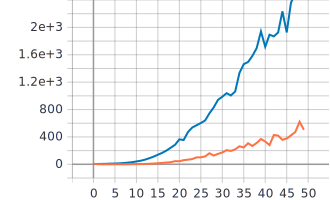
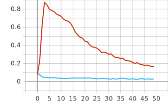
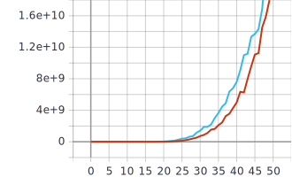

# Food-101 classification example using CNN on tf 2.x + keras
In this lab, I use a dataset of 101,000 images, divided into 101 classes.
```python
NUM_CLASSES = 101
TRAIN_SIZE = 101000
```
I use convolution, pooling, flatten, and fully-connected with softmax activation function layers 
1) Unmodified mode
```python
def build_model():
  inputs = tf.keras.Input(shape=(RESIZE_TO, RESIZE_TO, 3))
  x = tf.keras.layers.Conv2D(filters=8, kernel_size=3)(inputs)
  x = tf.keras.layers.MaxPool2D()(x)
  x = tf.keras.layers.Flatten()(x)
  outputs = tf.keras.layers.Dense(NUM_CLASSES, activation=tf.keras.activations.softmax)(x)
  return tf.keras.Model(inputs=inputs, outputs=outputs)
  ```



2) Modified the model

 ```python
 def build_model():
  inputs = tf.keras.Input(shape=(RESIZE_TO, RESIZE_TO, 3))
  x = tf.keras.layers.Conv2D(filters=16, kernel_size=3)(inputs)
  x = tf.keras.layers.Conv2D(filters=8, kernel_size=3)(x)
  x = tf.keras.layers.MaxPool2D()(x)
  x = tf.keras.layers.Conv2D(filters=16, kernel_size=3)(x)
  x = tf.keras.layers.Conv2D(filters=8, kernel_size=3)(x)
  x = tf.keras.layers.MaxPool2D()(x)
  x = tf.keras.layers.Flatten()(x)
  outputs = tf.keras.layers.Dense(NUM_CLASSES, activation=tf.keras.activations.softmax)(x)
  return tf.keras.Model(inputs=inputs, outputs=outputs)
 ```
 


3) Conclusion:
In this lab, I modified CNN by adding 3 convolutional layers and one pooling layer. The new network architecture contains 4 convolutional layers, compared to the previous one - 1 layer. However, the graphs before and after modification show that increasing the network depth did not lead to an increase in the training accuracy by reason of the insufficient number of trained parameters.
